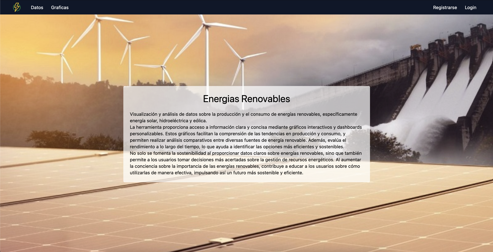
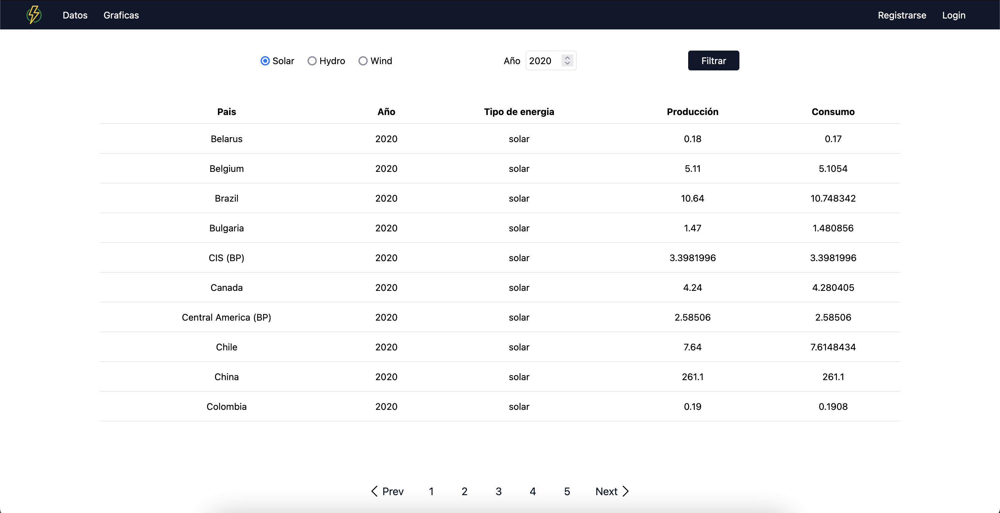
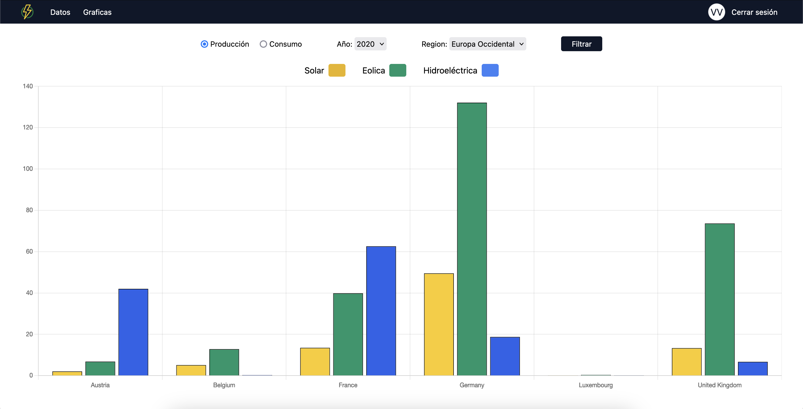
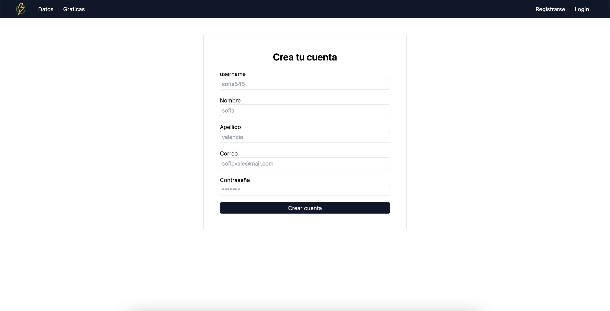
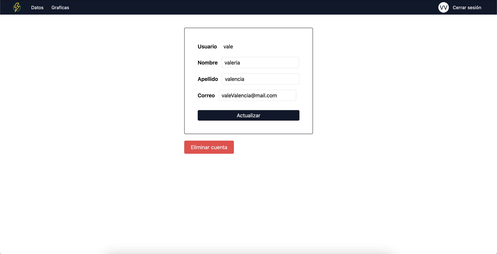

# Renewable Energies Frontend


Interfaz gráfica que consume los endpoints de un backend donde se proporciona información de producción y consumo de energías renovables, específicamente energía solar, eólica e hidroeléctrica.

La información se visualiza a través de una tabla donde se puede filtrar por tipo de energía y por año.
Se cuenta con gráficas de barras donde se puede comparar el consumo o la producción en un año específico, en una región específica, los tres tipos de energías: solar, eólica e hidroeléctrica.

Además, cuenta con un registro de usuario y un login, donde con este usuario registrado se tendrá acceso a las gráficas, usuario no registrado no tiene acceso a las gráficas. Además, hay una página de perfil de usuario donde se puede modificar la información o eliminar la cuenta.


## Instalación
Para instalar y ejecutar el proyecto, sigue estos pasos:
```bash
# Clona el repositorio
git clone git@github.com:soydz/renewableEnergiesFrontend.git

# Ingresar a la carpeta renewableEnergiesFrontend
cd renewableEnergiesFrontend

# Instalar dependencias
pnpm install

# Ejecutar el proyecto
pnpm start

# Accede a la aplicación en http://localhost:4200
```
## Screenshots











## Licencia

Este proyecto está bajo la licencia [GPL-3.0] - ver el archivo [LICENSE](./LICENSE) para más detalles.
